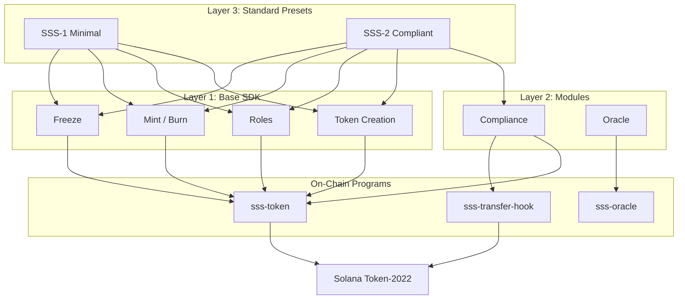

# Solana Stablecoin Standard (SSS)

A modular SDK with opinionated presets covering the most common stablecoin architectures on Solana. Built on **Token-2022** (SPL Token Extensions).

[](LICENSE)
[](https://explorer.solana.com/?cluster=devnet)
[]()
[]()

---

## Overview

The Solana Stablecoin Standard provides:

- **SSS-1 (Minimal Stablecoin)** — Mint authority + freeze authority + metadata + pause
- **SSS-2 (Compliant Stablecoin)** — SSS-1 + permanent delegate + transfer hook + blacklist
- **Oracle Module** — On-chain price feeds for non-USD-pegged stablecoins (BRL, EUR, XAU)

Each preset is a ready-to-deploy configuration that follows real-world stablecoin patterns (USDC, USDT, PYUSD, etc.).

## Architecture



## On-Chain Programs (3)

| Program | Description | Program ID |
|---------|-------------|-----------|
| **sss-token** | Core stablecoin (14 instructions) | `3TBnziiRfJEusEa21mg6UyEETUqPhr8EmjfoWPGzgCxk` |
| **sss-transfer-hook** | Blacklist enforcement hook | `J8sRn7M35NfUi511JY3Hnw4dPBm9UvwmpKCBrAbzCMKq` |
| **sss-oracle** | Price feed reader (Switchboard) | `2kouVKq1aQhwntSkTjgA8Nh6wtuxyYL1MjMnyA6srnGr` |

## Project Structure

```
solana-stablecoin-standard/
├── programs/
│   ├── sss-token/          # Core stablecoin program (14 instructions)
│   ├── sss-transfer-hook/  # Transfer hook for SSS-2 blacklist
│   └── sss-oracle/         # Oracle price feed reader
├── sdk/
│   └── core/               # TypeScript SDK (stablecoin, oracle, compliance)
├── cli/                    # CLI tool (12 commands)
├── services/               # Backend microservices (4) + Docker
├── tests/                  # 82 test cases (5 test files)
└── docs/                   # 13 documentation files
```

## Quick Start

### Prerequisites

- [Rust](https://rustup.rs/) (1.75+)
- [Solana CLI](https://docs.solanalabs.com/cli/install) (1.18+)
- [Anchor](https://www.anchor-lang.com/docs/installation) (0.31+)
- [Node.js](https://nodejs.org/) (20+)

### Build

```bash
# Install dependencies
npm install

# Build programs
anchor build

# Build SDK
cd sdk/core && npm install && npm run build

# Build CLI
cd cli && npm install && npm run build
```

### Deploy to Devnet

```bash
# Configure for devnet
solana config set --url devnet

# Airdrop SOL for deployment
solana airdrop 5

# Deploy programs
anchor deploy --provider.cluster devnet
```

### Initialize a Stablecoin

```bash
# Using CLI
sss init --preset sss-1 --name "My USD" --symbol MUSD --uri https://example.com/meta.json

# Using SDK
```

```typescript
import { SolanaStablecoin, Presets } from "@stbr/sss-token";

const sdk = new SolanaStablecoin({ connection, wallet });

const result = await sdk.create({
  ...Presets.SSS_1.defaults,
  name: "My USD",
  symbol: "MUSD",
  uri: "https://example.com/metadata.json",
});

console.log("Mint:", result.mint.toBase58());
console.log("Preset:", result.preset); // "SSS-1"
```

## Presets

### SSS-1: Minimal Stablecoin

For simple stablecoins, DAO treasury tokens, and wrapped assets.

| Feature | Description |
|---------|-------------|
| Mint Authority | PDA-controlled minting with per-minter quotas |
| Freeze Authority | Freeze/thaw individual token accounts |
| Metadata | On-chain name, symbol, URI |
| Roles | Master authority, minter, pauser |
| Pause | Global pause/unpause for all operations |

### SSS-2: Compliant Stablecoin

For USDC/USDT-class regulated tokens, CBDC pilots, and compliant RWA tokens.

Everything in SSS-1 plus:

| Feature | Description |
|---------|-------------|
| Permanent Delegate | Enables token seizure without owner signature |
| Transfer Hook | On-chain blacklist enforcement on every transfer |
| Blacklist | Add/remove addresses from on-chain blacklist |
| Token Seizure | Seize tokens from blacklisted/sanctioned accounts |

## Token-2022 Extensions Used

| Extension | Preset | Purpose |
|-----------|--------|---------|
| Mint Authority | SSS-1, SSS-2 | PDA-based controlled minting |
| Freeze Authority | SSS-1, SSS-2 | Account freezing capability |
| Permanent Delegate | SSS-2 | Token seizure (compliance) |
| Transfer Hook | SSS-2 | Blacklist enforcement on transfers |
| Default Account State | SSS-2 (opt.) | KYC-gated accounts (frozen by default) |

## Backend Services

Four microservices for production operations:

| Service | Port | Description |
|---------|------|-------------|
| Mint/Burn | 3001 | Authorized minting and burning REST API |
| Indexer | 3002 | On-chain event monitoring and indexing |
| Compliance | 3003 | Blacklist management and reporting |
| Webhook | 3004 | Event dispatching to external endpoints |

```bash
# Start all services
cd services
docker-compose up -d
```

## Testing (82 Test Cases)

| Test File | Tests | Coverage |
|-----------|-------|----------|
| sss-1.test.ts | 17 | Minimal preset lifecycle |
| sss-2.test.ts | 15 | Compliant preset + blacklist |
| sdk.test.ts | 12 | SDK unit tests |
| oracle.test.ts | 18 | Oracle PDA + mint/redeem computation |
| extended.test.ts | 20 | PDA uniqueness, preset validation, edge cases |

```bash
# Run all tests
anchor test

# Run individual test suites
npx ts-mocha tests/sdk.test.ts
npx ts-mocha tests/sss-1.test.ts
npx ts-mocha tests/sss-2.test.ts
npx ts-mocha tests/oracle.test.ts
npx ts-mocha tests/extended.test.ts
```

## Documentation (13 docs)

| Document | Description |
|----------|-------------|
| [Architecture](docs/ARCHITECTURE.md) | System design with Mermaid diagrams |
| [SDK Reference](docs/SDK.md) | TypeScript SDK API documentation |
| [SSS-1 Specification](docs/SSS-1.md) | Minimal stablecoin preset |
| [SSS-2 Specification](docs/SSS-2.md) | Compliant stablecoin preset |
| [Oracle](docs/ORACLE.md) | Oracle architecture and integration |
| [Compliance Guide](docs/COMPLIANCE.md) | Blacklist, seizure, and regulatory |
| [Operations](docs/OPERATIONS.md) | Deployment and operations guide |
| [API Reference](docs/API.md) | Backend services API documentation |
| [Deployment](docs/DEPLOYMENT.md) | Devnet deployment evidence & steps |
| [Security](docs/SECURITY.md) | Security model and threat analysis |
| [Testing](docs/TESTING.md) | Test architecture and coverage matrix |
| [Requirements](docs/REQUIREMENTS_TRACEABILITY.md) | Bounty requirements traceability |

## Devnet Deployment

All programs are deployed and verified on Solana Devnet:

| Program | Program ID | Explorer |
|---------|-----------|----------|
| **sss-token** | `3TBnziiRfJEusEa21mg6UyEETUqPhr8EmjfoWPGzgCxk` | [View on Explorer](https://explorer.solana.com/address/3TBnziiRfJEusEa21mg6UyEETUqPhr8EmjfoWPGzgCxk?cluster=devnet) |
| **sss-transfer-hook** | `J8sRn7M35NfUi511JY3Hnw4dPBm9UvwmpKCBrAbzCMKq` | [View on Explorer](https://explorer.solana.com/address/J8sRn7M35NfUi511JY3Hnw4dPBm9UvwmpKCBrAbzCMKq?cluster=devnet) |
| **sss-oracle** | `2kouVKq1aQhwntSkTjgA8Nh6wtuxyYL1MjMnyA6srnGr` | [View on Explorer](https://explorer.solana.com/address/2kouVKq1aQhwntSkTjgA8Nh6wtuxyYL1MjMnyA6srnGr?cluster=devnet) |

**Deployment Transactions:**
- sss-token: [`EPBXQBD7HwBzicEQLHzskgsjgeKrHMGmLkzpquJLYf5SpC998Pi9fKZuE3g7hWC6dWfSQJMsgLyFw4pN6g83mm4`](https://explorer.solana.com/tx/EPBXQBD7HwBzicEQLHzskgsjgeKrHMGmLkzpquJLYf5SpC998Pi9fKZuE3g7hWC6dWfSQJMsgLyFw4pN6g83mm4?cluster=devnet)
- sss-transfer-hook: [`2TZFJQqde2nsS5ScLSgsvmWbkxjhpXLQ3sLiwfsxS4rdxEo3qMfJLxeqgKnRgSZ1JBCUHsf6ETbwi4H5djqWWC3q`](https://explorer.solana.com/tx/2TZFJQqde2nsS5ScLSgsvmWbkxjhpXLQ3sLiwfsxS4rdxEo3qMfJLxeqgKnRgSZ1JBCUHsf6ETbwi4H5djqWWC3q?cluster=devnet)

> See [DEPLOYMENT.md](docs/DEPLOYMENT.md) for full deployment evidence including cost analysis.

## License

MIT
