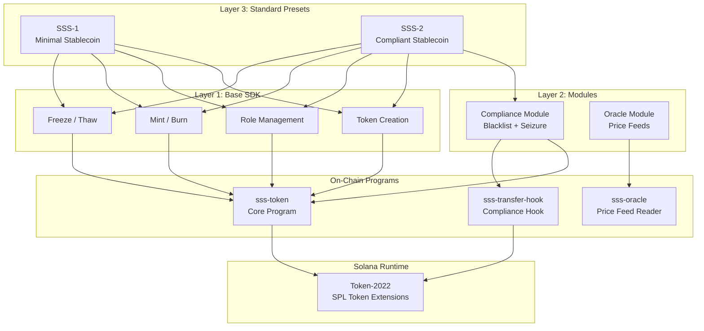
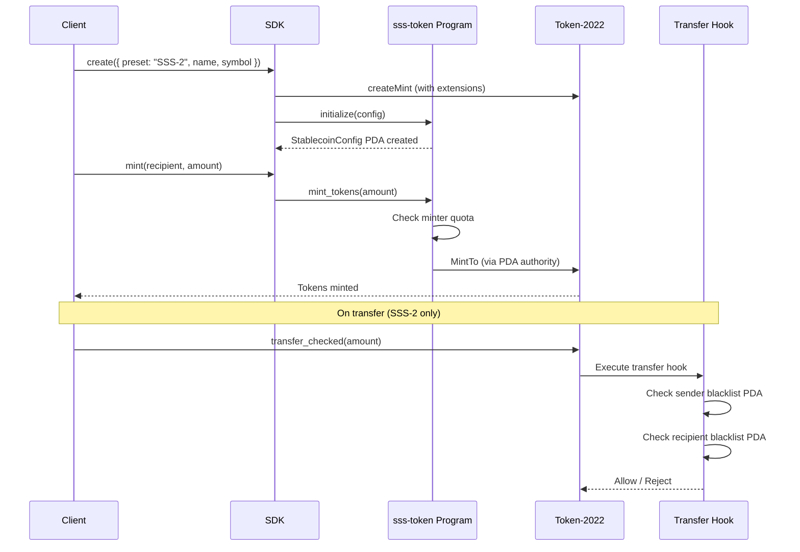
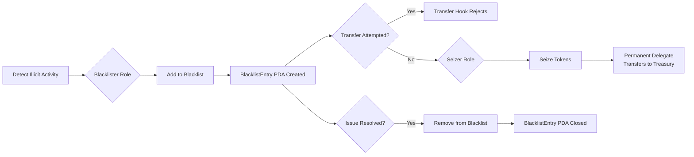
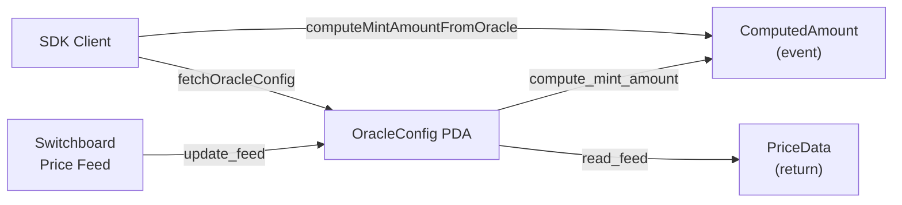
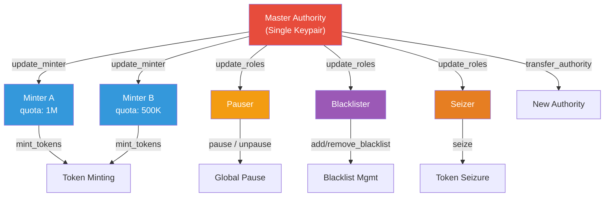
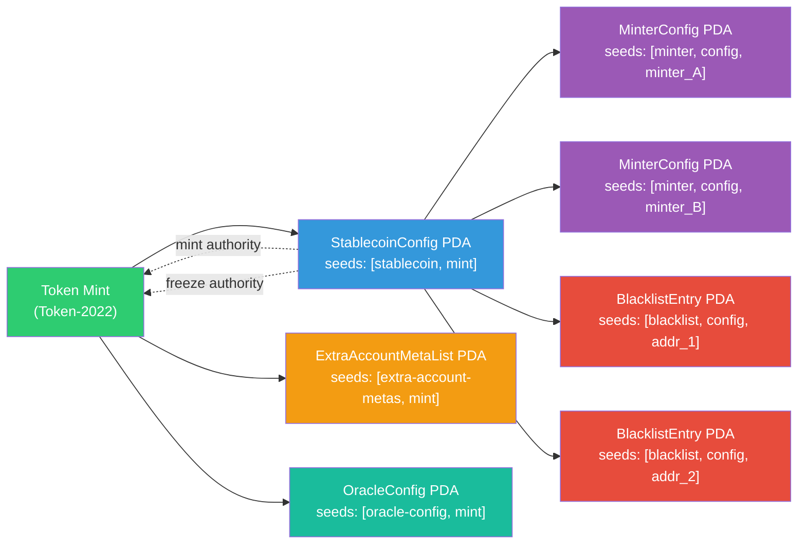

# Architecture

## System Overview

The Solana Stablecoin Standard (SSS) is a three-layer architecture:

```
Layer 3: Standard Presets (SSS-1, SSS-2)
Layer 2: Modules (Compliance, Privacy, Oracle)
Layer 1: Base SDK (Token Creation, Roles, Mint/Burn, Freeze)
```

### Layer Architecture Diagram



### Mint Lifecycle Flow



### Compliance Flow (SSS-2)



## On-Chain Programs

### sss-token (Core Program)

The main Anchor program that manages stablecoin lifecycle operations.

**Program ID**: `3TBnziiRfJEusEa21mg6UyEETUqPhr8EmjfoWPGzgCxk`

#### Account Structure

```
StablecoinConfig (PDA: ["stablecoin", mint])
├── authority: Pubkey          # Master authority
├── mint: Pubkey               # Token-2022 mint
├── name: String               # Token name
├── symbol: String             # Token symbol
├── uri: String                # Metadata URI
├── decimals: u8               # Token decimals
├── enable_permanent_delegate  # SSS-2 flag
├── enable_transfer_hook       # SSS-2 flag
├── default_account_frozen     # Optional KYC gating
├── transfer_hook_program      # Hook program ID
├── pauser: Pubkey             # Pauser role
├── blacklister: Pubkey        # Blacklister role (SSS-2)
├── seizer: Pubkey             # Seizer role (SSS-2)
├── paused: bool               # Global pause state
├── total_minted: u64          # Cumulative minted
├── total_burned: u64          # Cumulative burned
└── bump: u8                   # PDA bump

MinterConfig (PDA: ["minter", config, minter])
├── stablecoin: Pubkey         # Parent config
├── minter: Pubkey             # Minter address
├── quota: u64                 # Maximum mint amount
├── minted: u64                # Amount minted so far
├── active: bool               # Whether minter is active
└── bump: u8

BlacklistEntry (PDA: ["blacklist", config, address])
├── stablecoin: Pubkey         # Parent config
├── address: Pubkey            # Blacklisted address
├── reason: String             # Reason
├── created_at: i64            # Timestamp
├── blacklisted_by: Pubkey     # Who added it
└── bump: u8
```

#### Instruction Set

| Instruction | Access | Preset | Description |
|-------------|--------|--------|-------------|
| `initialize` | Authority | All | Create stablecoin config |
| `mint_tokens` | Minter | All | Mint tokens (quota enforced) |
| `burn_tokens` | Any holder | All | Burn own tokens |
| `freeze_account` | Authority | All | Freeze token account |
| `thaw_account` | Authority | All | Thaw frozen account |
| `pause` | Pauser | All | Pause all operations |
| `unpause` | Pauser | All | Resume operations |
| `update_minter` | Authority | All | Add/update minter quota |
| `update_roles` | Authority | All | Change role assignments |
| `transfer_authority` | Authority | All | Transfer master authority |
| `add_to_blacklist` | Blacklister | SSS-2 | Blacklist an address |
| `remove_from_blacklist` | Blacklister | SSS-2 | Remove from blacklist |
| `seize` | Seizer | SSS-2 | Seize tokens via delegate |

### sss-transfer-hook (Hook Program)

Enforces blacklist rules on every token transfer. Invoked automatically by Token-2022 when transfer hook extension is active.

**Program ID**: `J8sRn7M35NfUi511JY3Hnw4dPBm9UvwmpKCBrAbzCMKq`

#### How It Works

1. When a transfer is initiated, Token-2022 calls the transfer hook
2. The hook resolves extra account metas (sender + recipient blacklist PDAs)
3. If either PDA account exists, the transfer is rejected
4. Normal (non-blacklisted) transfers proceed without issue

```
Transfer Flow (SSS-2):
User calls transfer_checked → Token-2022 → Transfer Hook
                                              ├── Check sender blacklist PDA
                                              ├── Check recipient blacklist PDA
                                              └── Allow or reject
```

### sss-oracle (Oracle Program)

Provides on-chain price-feed integration for non-USD-pegged stablecoins (BRL, EUR, Gold, etc.). Reads from Switchboard-compatible oracles and computes mint/redeem amounts at live exchange rates.

**Program ID**: `2kouVKq1aQhwntSkTjgA8Nh6wtuxyYL1MjMnyA6srnGr`

#### Oracle Instructions

| Instruction | Access | Description |
|-------------|--------|-------------|
| `initialize_oracle` | Authority | Create oracle config for a mint |
| `update_feed` | Authority | Update price data from feed |
| `compute_mint_amount` | Any | Calculate mint amount at price |
| `compute_redeem_amount` | Any | Calculate redeem amount at price |
| `read_feed` | Any | Read current oracle price |



## Role-Based Access Control

```
Master Authority
├── Can manage all roles
├── Can transfer authority
└── Assigns:
    ├── Minter(s) — with per-minter quotas
    ├── Pauser — pause/unpause operations
    ├── Blacklister — manage blacklist (SSS-2)
    └── Seizer — seize tokens (SSS-2)
```

### RBAC Hierarchy Diagram



## PDA Derivation

| PDA | Seeds | Purpose |
|-----|-------|---------|
| StablecoinConfig | `["stablecoin", mint]` | Config + mint/freeze authority |
| MinterConfig | `["minter", config, minter]` | Per-minter quota tracking |
| BlacklistEntry | `["blacklist", config, address]` | On-chain blacklist |
| ExtraAccountMetaList | `["extra-account-metas", mint]` | Transfer hook meta |
| OracleConfig | `["oracle-config", mint]` | Oracle price feed config |

### PDA Relationship Diagram



## Security Considerations

1. **PDA as Authority**: The StablecoinConfig PDA serves as both mint authority and freeze authority, ensuring all operations go through the program
2. **Quota Enforcement**: Each minter has an independent quota, preventing any single key from minting unlimited tokens
3. **Atomic Blacklist Checks**: Transfer hook checks are atomic — if the hook program is unavailable, transfers fail (safe default)
4. **Upgrade Authority**: Programs should be deployed as immutable or with a multisig upgrade authority in production
5. **Oracle Feed Staleness**: Oracle module enforces configurable staleness thresholds — stale price data will be rejected
